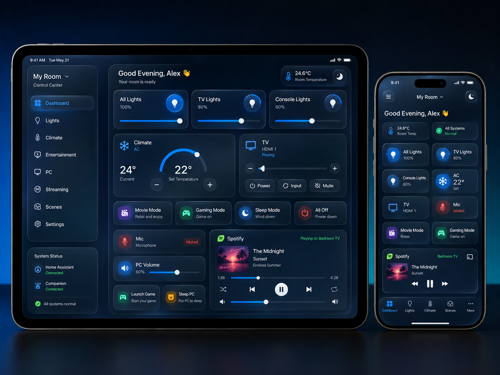

# App design and Liquid Glass

## Product direction

The application should become a personal control layer for the user’s room rather than a collection of separate remotes.

It must unify devices and services around common capabilities such as power, brightness, temperature, volume, media playback, source selection, application launching, audio routing, and scene activation.

The dashboard should show real device state and support continuous controls, not merely trigger actions blindly.

Use Apple’s native Liquid Glass design language throughout the application.

The visual direction should feel like a polished first-party iPadOS application rather than a generic smart-home dashboard or Stream Deck clone.

Use the current official SwiftUI Liquid Glass APIs available for the project’s deployment target. Verify the exact APIs against Apple’s current documentation before implementation. Do not recreate Liquid Glass using third-party libraries or excessive custom blur effects when native APIs are available.

## Design principles

- Clean, modern, premium Apple-style interface
- Dark appearance by default, with full light-mode support
- Designed primarily for iPad landscape orientation
- Responsive layouts for different iPad and iPhone sizes
- Fast native navigation with no webpage loading
- Large, comfortable touch targets
- Clear visual hierarchy
- Minimal visual clutter
- Subtle depth, refraction, highlights, and translucency
- Strong readability and accessibility over decorative effects
- Use Liquid Glass selectively rather than covering every surface with glass

## Use Liquid Glass for

- Navigation sidebar or floating navigation controls
- Top toolbar and room status controls
- Scene buttons
- Compact action buttons
- Control overlays
- Media controls
- Context menus
- Sheets and popovers
- Status pills
- Floating controls
- Tab bar on iPhone
- Selected or interactive dashboard elements

## Use more stable, quieter surfaces for

- Large information-heavy dashboard cards
- Climate information
- Device lists
- Settings forms
- Long text
- Diagnostic information

## Visual language

The interface should combine:

- Layered translucent surfaces
- Frosted and refractive glass materials
- Soft specular highlights
- Subtle border illumination
- Gentle background color diffusion
- Smooth depth transitions
- Native spring animations
- SF Symbols
- System typography
- Consistent rounded geometry

Avoid:

- Applying strong glass effects to every card
- Excessive blur that reduces readability
- Heavy neon glow
- Overly transparent controls
- Fake glass gradients that do not behave naturally
- Large numbers of nested translucent layers
- Animations that delay interaction
- A futuristic gaming interface that no longer feels native to iPadOS
- Copying the exact appearance of Apple system apps

Liquid Glass must enhance hierarchy and interaction, not become decoration for its own sake.

## Interaction behavior

- Controls should provide an immediate visual response when touched
- Glass surfaces may subtly brighten, compress, refract, or lift during interaction
- Use smooth native SwiftUI transitions
- Keep animations short and responsive
- Page switching must feel immediate
- Do not block interaction while commands are executing
- Use optimistic state updates where appropriate
- Display pending, successful, failed, and offline states clearly
- Use subtle haptic feedback for important actions
- Respect Reduce Motion and Reduce Transparency accessibility settings

## Reusable visual components

The visual system should include reusable components such as:

- `LiquidGlassContainer`
- `GlassNavigationItem`
- `GlassActionButton`
- `GlassSceneButton`
- `GlassStatusPill`
- `GlassToolbar`
- `GlassTabBar`
- `GlassControlOverlay`
- `GlassConnectionBadge`

Do not create a custom abstraction that merely wraps every view in the same glass modifier. Each component should use Liquid Glass intentionally based on its role.

Create a centralized design system containing:

- Spacing tokens
- Corner-radius tokens
- Typography styles
- Surface hierarchy
- Glass prominence levels
- Accent colors
- Semantic status colors
- Animation durations
- Haptic behavior

## Suggested surface hierarchy

1. Background: deep adaptive gradient or subtle environmental color field.
2. Primary content: low-distraction cards with excellent readability.
3. Interactive Liquid Glass: buttons, navigation, scene controls, media controls, and overlays.
4. Elevated Liquid Glass: sheets, popovers, focused controls, and contextual interfaces.

## Approved dashboard mockup

The dashboard should visually resemble the approved mockup:

- Dark navy adaptive background
- Left Liquid Glass navigation sidebar on iPad
- Compact Liquid Glass bottom navigation on iPhone
- Three lighting cards across the top of the iPad dashboard
- Climate and TV controls in the center
- Scene controls for Movie, Gaming, Sleep, and All Off
- Microphone, PC volume, launch-game, and sleep-PC controls
- A polished Spotify/media control card
- Home Assistant and Companion connection indicators
- Blue and cyan primary accents
- Purple, green, amber, and red semantic accents for scenes and device states

### Custom control deck

- Let users add, edit, delete, and reorder dashboard controls without leaving the dashboard
- Support Companion action buttons with custom names, SF Symbols, semantic accent colors, and page/row/column mappings
- Support one-level folders for related actions such as game launchers
- Support live PC status, microphone, and volume widgets
- Persist the customized layout locally and preserve existing Launch Game and Sleep PC mappings during migration
- Require an explicit opt-in confirmation flag for buttons that may be destructive
- Keep Companion tests clearly labeled as request acceptance rather than backend-state completion

Keep content legible when the background changes. Test all Liquid Glass surfaces over both dark and bright backgrounds.

## Compatibility

- Use native Liquid Glass on supported operating-system versions
- Provide a graceful fallback using standard SwiftUI materials on older supported versions
- Keep the fallback visually consistent
- Isolate availability checks inside reusable UI components rather than scattering them throughout feature views
- The app must compile without warnings caused by unavailable APIs

## Code quality rules

- Use Apple’s native Liquid Glass APIs where supported
- Verify Liquid Glass APIs against current official Apple documentation
- Provide standard SwiftUI material fallbacks for older OS versions
- Do not sacrifice readability or performance for glass effects
- Respect Reduce Transparency, Increase Contrast, and Reduce Motion
- Avoid applying identical glass styling to every surface
- Keep availability checks inside the design-system components

## Remote access

The application must support secure operation from outside the home network, including when the iPhone or iPad is connected through cellular data.

### Home Assistant

- Support separate local and remote Home Assistant URLs
- Automatically prefer the local URL when reachable
- Fall back to the remote URL when outside the home
- Support HTTPS and secure WebSocket connections
- Store credentials only in Keychain
- Never disable TLS certificate validation
- Support Home Assistant Cloud, VPN-hosted URLs, and secure reverse proxies
- Restore WebSocket subscriptions after changing between Wi-Fi and cellular
- Detect network-path changes using `NWPathMonitor`
- Display whether the active connection is Local, Remote, or Offline

### PC controls

- Do not expose Bitfocus Companion directly to the public internet
- Allow Companion-backed dashboard actions to be mapped, tested, and saved from the dashboard itself
- Keep the Settings mapping tools as an advanced fallback
- Prefer routing remote PC commands through Home Assistant scripts or automations
- Companion should receive commands only over the home LAN or a private VPN
- Support an optional Tailscale/private-VPN Companion address
- Add a Home Assistant-backed PC online-state sensor
- Queue actions that require the PC to wake
- Support Wake-on-LAN before executing configured PC actions
- Cancel queued actions after a configurable timeout
- Require confirmation for destructive remote commands
- Never open or recommend direct router port forwarding to Companion

### PC keyboard and touchpad remote

- Route all keyboard and pointer input exclusively through the authenticated Windows Control Agent
- Never send high-frequency input through Companion or Home Assistant
- Support relative pointer motion, click, two-finger scroll/right-click, press-and-drag, precision mode, acceleration, and sensitivity settings
- Use the native iOS/iPadOS keyboard for Unicode text, including Arabic and English
- Support held modifiers, special keys, shortcuts, function keys, and media keys
- Release all held keys and buttons after interruption or disconnection
- Coalesce high-frequency pointer events, discard stale events, and prioritize all release events
- Require pairing and a separate Windows-side Allow Remote Input permission
- Pause immediately in unsafe or disconnected states
- Read clipboard text only following an explicit user action and never continuously synchronize it
- Do not store or log keyboard or clipboard content
- Do not bypass Windows secure desktop, UAC, integrity-level restrictions, anti-cheat systems, or the lock screen
- Keep the production endpoint private to a LAN, private VPN, or secure authenticated relay

### Command behavior

- Show immediate pending feedback
- Confirm completion from actual backend state when possible
- Clearly distinguish queued, running, successful, failed, and unavailable commands
- Do not claim a PC command succeeded merely because the HTTP request was accepted

## Updated implementation phases

### Phase 1

- Inspect the existing repository
- Preserve the working Bitfocus Companion integration
- Build the customizable dashboard models
- Build the widget layout system
- Build mock widgets and responsive layouts
- Build the Liquid Glass design system
- Convert the existing fixed dashboard into a Room Control template

### Phase 2

- Add edit mode, widget gallery, widget configuration, resizing, and reordering
- Add SwiftData persistence
- Add iPad and iPhone layout overrides

Phase 2 implementation preserves the separately persisted Companion Control Deck and mappings. Removing a dashboard widget must not delete its integration credentials or Companion configuration.

Widget sizes also control information density, not only grid width:

- Small widgets show primary state and one essential action or control
- Medium widgets show essential stateful controls without advanced detail
- Large and wide widgets expose the full supported capability set
- Text, availability, and controls must never be compressed into unreadable narrow columns

### Phase 3

- Create the Home Assistant client foundation
- Add secure settings and Keychain storage
- Add connection testing, REST entity-state loading, and WebSocket live updates
- Add mock and real light control with local and remote URL support

### Phase 4

- Add Home Assistant-backed Govee, Gree, Smart Life/Tuya, and LG webOS widgets
- Add capability discovery and dynamic control rendering

### Phase 5

- Add scene orchestration, progress reporting, guarded PC boot, remote execution, and integration health

### Phase 6

- Define the Windows Agent protocol and authenticated pairing design
- Add Windows audio, application/game, and GoXLR mixer mocks
- Keep existing Companion actions working

### Phase 7

- Implement the Windows Agent separately
- Add Windows audio routing, per-application volume, GoXLR state, games, applications, and PC state

### Phase 8

- Add App Intents, Siri, Shortcuts, Control Center, Home Screen, and Lock Screen widgets
- Add context-aware dashboards later

## Current implementation focus

Continue Phase 5: Home Assistant-backed PC online state, Wake-on-LAN, configurable queue timeouts, guarded PC boot, and command progress that distinguishes accepted wake requests from confirmed PC availability.

Do not implement direct vendor APIs. Govee, Gree, Smart Life/Tuya, and TV control initially go through Home Assistant. Keep the working Companion integration private to the LAN or private VPN, and keep Windows input behind the future authenticated Windows Control Agent.
